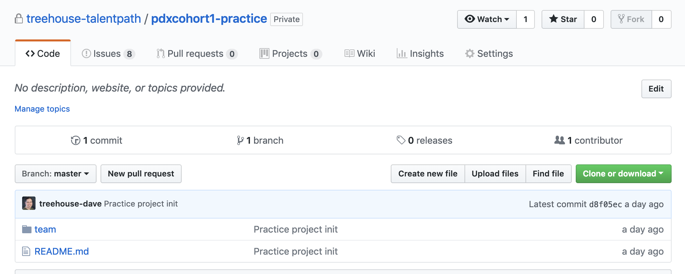
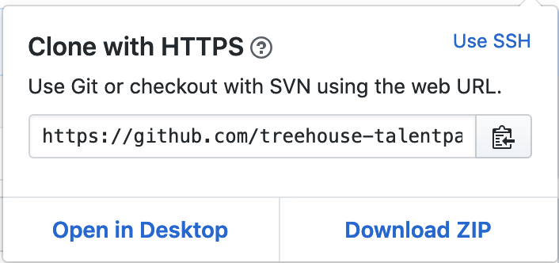
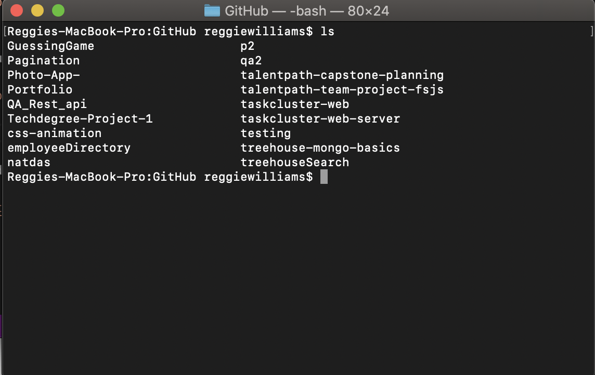

# Cloning a Repository Locally 
To work on the project on your own machines you'll need to clone the project.
## Navigate to project repository 
* Go to the GitHub repository you would like to clone.

## Click clone or download button 


## Copy remote URL 
Copy the remote URL that is displayed when you click the clone or download button. 



## Clone repository 
* In your terminal use the `cd` command and the address of your local GitHub folder 
* Use the `git clone` command and address copied from GitHub 

 > ```git clone https://github.com/treehouse-talentpath/pdxcohort1-practice.git ```

## Check to make sure the repo was cloned 
* Use `ls` to view contents of current directory and make sure the repo is there
 > ```ls ```


## Enter project directory

> ```cd talentpath-team-project-fsjs```
