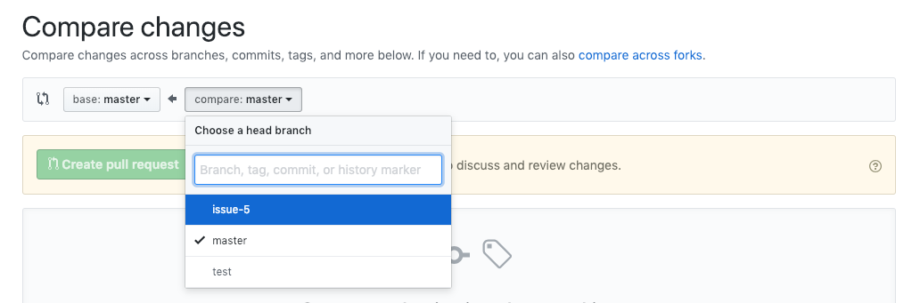
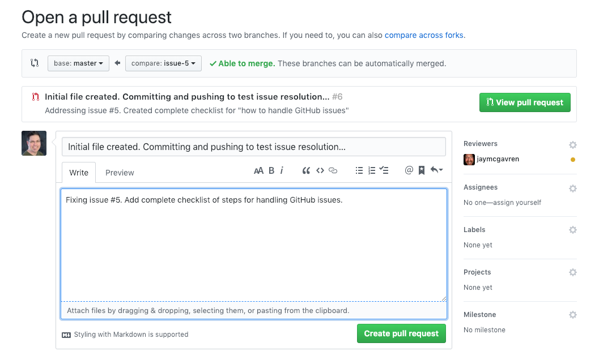
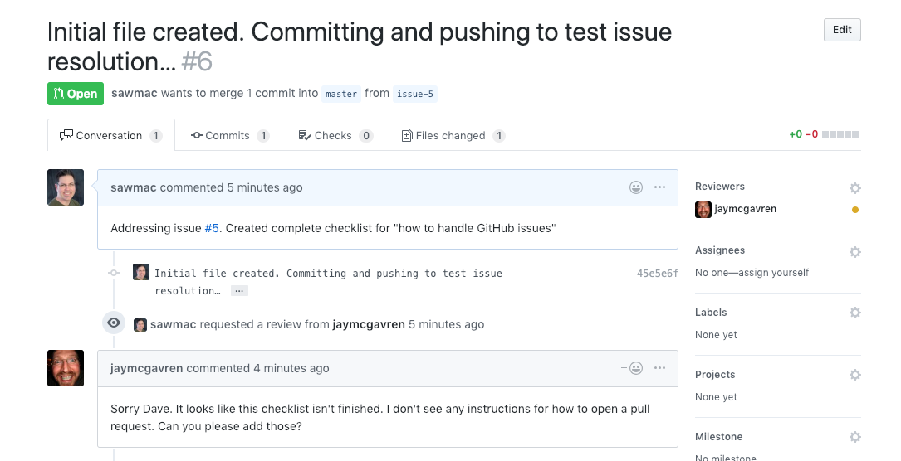

# Handling GitHub Issues
You'll be assigned issues -- bug fixes, feature requests -- in GitHub. Read the Issue in GitHub to figure out what needs to be done. Make a note of the issue number because you'll use that number when creating a branch.

## Get the code and fix issue locally
1. **Pull down the latest code**
   
   > ```git pull origin master```

2. **Create and checkout branch to work on issue.** For example if the issue number is 52:

    > ```git checkout -b issue-52```

3. **Make changes required by the issue and commit.** Make sure to commit early and often -- it's good to commit when you've fixed one thing for example. Then, if there's another thing to fix, do that then make a second commit. However, don't commit incomplete work -- for example, if you haven't completely fixed a bug you are working on complete that fix before committing. 

    > ```git add .``` -- stages all changes
   
    > ```git commit``` -- use the editor so you can provide longer commit messages (if needed)

4. **Push your branch up to GitHub.** For example, if the issue # is 52, and the branch is issue-52.

    >```git push origin issue-52```

## Create Pull Request on GitHub
1. **Go to the project repo on GitHub**, and click the Pull Request tab.
2. **Click the New Pull Request button.**
3. **From the "Compare" drop-down, select the branch you pushed to fix the issue.**

4. **Click the "Create Pull Request" button.**
5. **Write a description for the pull request.** Here you can describe the changes you made to fix the issue.
6. **Assign the PR to one of your team mates for code review.**

7. **Click the "Create pull request" button.**

If your PR fixes the issue, then the code reviewer will accept the PR and merge your branch into master. If not...

## Resolve any issues
If the code reviewer found a problem in your code, they'll comment on the PR and you'll need to resolve any problems they found


1. **Make sure you are still on the issue branch you created.**
    >```git checkout issue-52```

2. **Make required changes.**
3. **Stage, commit and push** (as described above)
4. **On GitHub go to the Pull Request you created earlier -- add a note and tag the code reviewer to let them know that you've updated the branch.** They'll review your code again -- repeat these steps until the PR is accepted.

# Close the Pull Request
Once your code is approved by the reviewer it's time to close the PR.

1. **Make sure you are still on the issue branch you created.**
    >```git checkout issue-52```

2. **Make required changes.**
3. **Stage, commit and push** (as described above)
4. **On GitHub go to the Pull Request you created earlier -- add a note and tag the code reviewer to let them know that you've updated the branch.** They'll review your code again -- repeat these steps until the PR is accepted.

At this point, you're done, and you should delete your local branch -- but don't do this until you know the PR's been accepted.

> ```git branch -d issue-52```

At this point, you're done, and you should delete your local branch -- but don't do this until you know the PR's been accepted.

> ```git branch -d issue-52```